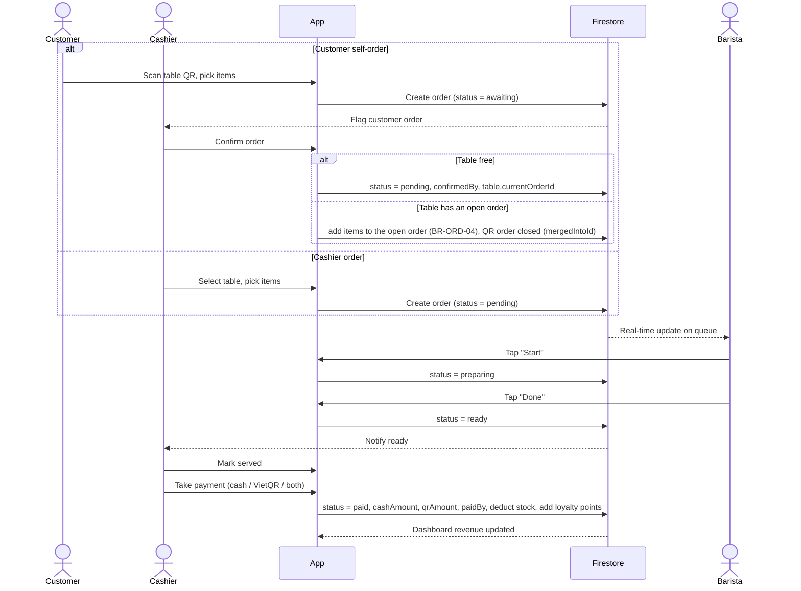
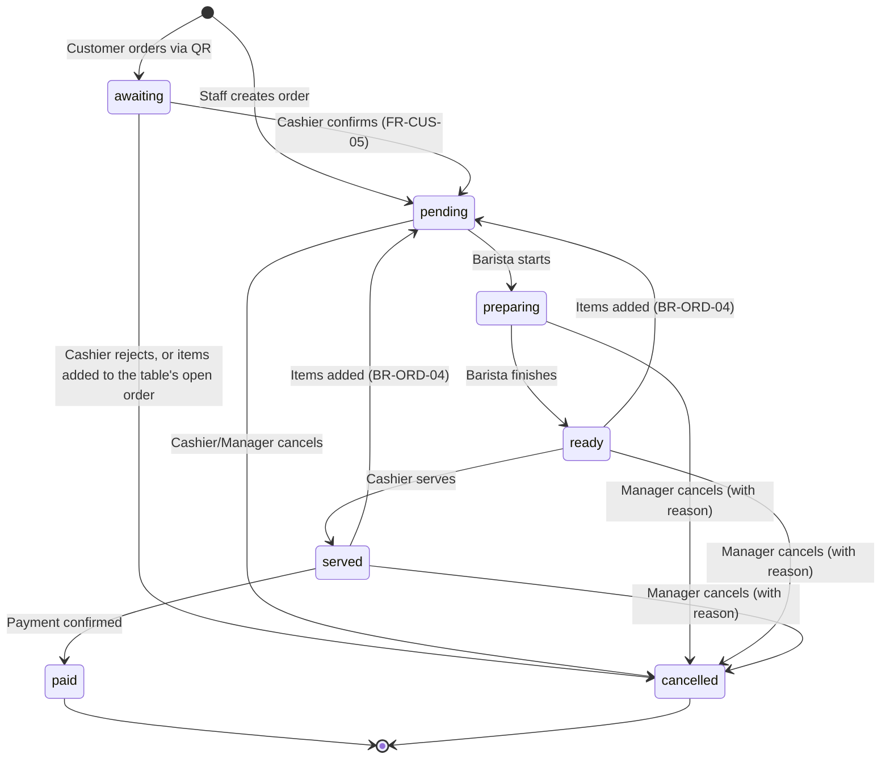
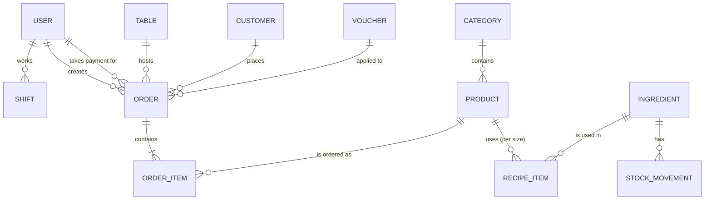
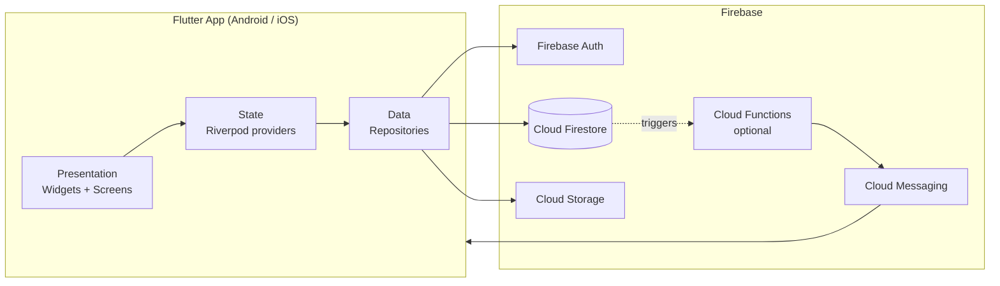

# Cafe Shop Management System — Product Brief

> Working name: **BrewBoss** (placeholder, rename freely)
> Platform: Flutter mobile (Android + iOS), tablet-friendly
> Team: 5 members
> Status: Draft v0.1 — 2026-09-23
>
> This document is the single source for the upcoming **SRS** (Software Requirements Specification) and **SDS** (Software Design Specification).
> Each section notes where it maps: `→ SRS §x` / `→ SDS §x` (section numbers follow IEEE 830 for the SRS and IEEE 1016 for the SDS).

---

## Table of Contents

1. [Overview](#1-overview)
2. [Stakeholders & Actors](#2-stakeholders--actors)
3. [Scope](#3-scope)
4. [Core Business Flows](#4-core-business-flows)
5. [Functional Requirements](#5-functional-requirements)
6. [Non-Functional Requirements](#6-non-functional-requirements)
7. [User Stories & Acceptance Criteria](#7-user-stories--acceptance-criteria)
8. [Screen Inventory](#8-screen-inventory)
9. [Data Model](#9-data-model)
10. [System Architecture](#10-system-architecture)
11. [Business Rules](#11-business-rules)
12. [Security & Access Control](#12-security--access-control)
13. [Team Split & Ownership](#13-team-split--ownership)
14. [Timeline & Milestones](#14-timeline--milestones)
15. [Testing Strategy](#15-testing-strategy)
16. [Risks & Mitigations](#16-risks--mitigations)
17. [Assumptions & Open Questions](#17-assumptions--open-questions)
18. [Glossary](#18-glossary)
19. [SRS / SDS Mapping](#19-srs--sds-mapping)

---

## 1. Overview

`→ SRS §1.1–1.2, §2.1`

### 1.1 Problem

Small and mid-size cafes in Vietnam typically run on paper order slips, verbal handoffs between cashier and barista, and end-of-day manual cash counting. This causes:

- Lost or wrong orders during peak hours.
- No visibility into which items sell best or which ingredients are running out.
- Revenue leakage (unrecorded sales, untracked discounts).
- Time-consuming staff shift and attendance tracking.

### 1.2 Solution

A single Flutter mobile app with **role-based access** that digitizes the full order lifecycle — from order creation (by cashier or by customer via table QR) to barista preparation, payment (cash or VietQR), automatic inventory deduction, and real-time reporting.

### 1.3 Goals

| ID | Goal | Measurable target (demo) |
|---|---|---|
| G1 | Faster order handoff | Order visible on barista screen < 2 s after creation |
| G2 | Accurate inventory | Stock auto-deducted on every paid order via recipes |
| G3 | Instant business insight | Revenue dashboard updates in real time |
| G4 | Less manual admin | Staff check-in/out and shift history without paper |

### 1.4 Non-goals (this release)

- Multi-branch / franchise management.
- Full accounting (tax filing, invoices under Decree 123 e-invoice rules).
- Delivery platform integration (GrabFood, ShopeeFood).
- Bluetooth thermal printer support.
- Offline-first sync.

---

## 2. Stakeholders & Actors

`→ SRS §2.3 (User Characteristics), Use Case diagram`

| Actor | Description | Primary device | Key needs |
|---|---|---|---|
| **Owner / Manager** | Runs the shop, manages menu, staff, stock | Phone | Revenue, best sellers, low-stock alerts, staff control |
| **Cashier** | Takes orders at the counter, handles payment | Tablet / phone | Fast order entry, table map, payment |
| **Barista** | Prepares drinks | Tablet mounted at bar | Clear real-time order queue |
| **Customer** | Visits the shop | Own phone (via QR) | View menu, order from table, collect loyalty points |
| **Firebase (system)** | External backend | — | Auth, database, storage, push notifications |

> A single user has exactly one role. Manager has all Cashier and Barista permissions.

---

## 3. Scope

`→ SRS §1.2, §2.2 (Product Functions)`

### 3.1 Priority levels

- **P0 — Must have**: required for the core demo flow.
- **P1 — Should have**: differentiators, planned in the schedule.
- **P2 — Could have**: only if time allows.

### 3.2 Module overview

| Module | Code | P0 | P1 | P2 |
|---|---|---|---|---|
| Authentication & Staff | `AUTH`, `STAFF` | Login, roles, staff CRUD | Shifts, check-in/out, cash handover | QR/GPS check-in |
| Menu | `MENU` | Categories, products, sizes, toppings | Images, availability toggle | Combo items |
| Inventory | `INV` | Ingredients CRUD, manual stock in/out | Recipe-based auto deduction, waste on cancel, stocktake, low-stock alert | Supplier management |
| Point of Sale | `POS` | Table map, create order, cash payment | Vouchers, VietQR payment, split cash + VietQR payment, merge/split table | PDF receipt |
| Barista Display | `BAR` | Real-time queue, status update | Push notification on "ready" | Prep time stats |
| Customer Ordering | `CUS` | — | Scan table QR, browse menu, place order | Order tracking |
| Reports | `RPT` | Daily revenue, order list | Charts, best sellers, date range | Export PDF/Excel |
| Loyalty | `LOY` | — | Points by phone number, vouchers | Tiered membership |

---

## 4. Core Business Flows

`→ SRS §3 (use cases), SDS sequence diagrams`

### 4.1 Main flow — dine-in order



### 4.2 Order status state machine



Rules:
- `awaiting` orders are not on the barista queue and do not occupy the table until a cashier confirms them. If the table already has an open order, confirming adds the items to that order instead (BR-ORD-07).
- Items can be added in any open status (`pending`, `preparing`, `ready`, `served`); existing lines can be edited or removed only while `pending` (BR-ORD-04).
- Only Manager can cancel an order in `preparing`, `ready` or `served` state. The cancel dialog asks whether the drinks were already made (BR-INV-02).
- `paid` and `cancelled` are terminal; no edits allowed.
- Payment happens only after service (`served → paid`), for dine-in and takeaway alike. There is no pay-first flow (BR-PAY-04).

### 4.3 Other flows

| Flow | Summary |
|---|---|
| Confirm customer order | Cashier opens a flagged `awaiting` order, checks it and confirms: free table → `pending`, table becomes occupied; table with an open order → items added to that order (BR-ORD-04) and the QR order closed. Or rejects it with a reason → `cancelled` (BR-ORD-07) |
| Merge tables | Two `served` orders on different tables → source items move to the target order, source order is closed and its table freed (BR-ORD-08) |
| Takeaway order | Same as dine-in but `tableId = null`; the cashier marks it served when handed over, then takes payment |
| Stock in | Manager records received ingredients and their cost → stock increases, history logged with `cost` |
| Cancel after making | Manager cancels a `preparing`/`ready`/`served` order and ticks "Đã pha" → ingredients deducted by recipe as waste (BR-INV-02) |
| Stocktake | Manager enters counted stock per ingredient → system logs the difference as an adjustment (BR-INV-03) |
| Low-stock alert | After deduction, if `stock <= minStock` → push notification to Manager |
| Shift check-in | Staff taps "Check in" → shift record with timestamp; "Check out" closes it. Cashier also enters opening cash at check-in |
| Cash handover | At check-out the cashier counts the drawer → system compares it with expected cash and records the difference (BR-STAFF-03..05) |
| Split payment | One order paid partly in cash and partly by VietQR → both amounts stored on the order (BR-PAY-01) |
| Loyalty earn | On payment, cashier enters phone → points added (see BR-LOY-01) |

---

## 5. Functional Requirements

`→ SRS §3.1 (Functional Requirements)`

Format: `FR-<MODULE>-<NN>` · Priority · Actor(s)

### 5.1 Authentication (`AUTH`)

| ID | Requirement | Priority | Actor |
|---|---|---|---|
| FR-AUTH-01 | User logs in with email + password | P0 | All staff |
| FR-AUTH-02 | App routes user to the home screen of their role after login | P0 | All staff |
| FR-AUTH-03 | User can log out | P0 | All staff |
| FR-AUTH-04 | User can reset password via email | P1 | All staff |
| FR-AUTH-05 | Session persists across app restarts until logout | P0 | All staff |
| FR-AUTH-06 | Deactivated accounts cannot log in | P0 | System |

### 5.2 Staff Management (`STAFF`)

| ID | Requirement | Priority | Actor |
|---|---|---|---|
| FR-STAFF-01 | Manager creates staff account (name, email, phone, role) | P0 | Manager |
| FR-STAFF-02 | Manager edits staff info and role | P0 | Manager |
| FR-STAFF-03 | Manager deactivates / reactivates staff | P0 | Manager |
| FR-STAFF-04 | Staff checks in / checks out of a shift | P1 | Cashier, Barista, Manager |
| FR-STAFF-05 | Manager views shift history and total hours per staff per period | P1 | Manager |
| FR-STAFF-06 | Check-in requires scanning the shop's QR code | P2 | Cashier, Barista |
| FR-STAFF-07 | Cashier enters opening cash at check-in and counted cash at check-out; system shows expected cash and the difference | P1 | Cashier, Manager |
| FR-STAFF-08 | Manager views cash handover per shift (opening, cash sales, VietQR sales, expected, counted, difference) and filters shifts with a difference | P1 | Manager |

### 5.3 Menu (`MENU`)

| ID | Requirement | Priority | Actor |
|---|---|---|---|
| FR-MENU-01 | Manager CRUDs categories (name, display order) | P0 | Manager |
| FR-MENU-02 | Manager CRUDs products (name, category, base price, description) | P0 | Manager |
| FR-MENU-03 | Product supports sizes with price delta (e.g. S +0, M +5k, L +10k) | P0 | Manager |
| FR-MENU-04 | Product supports toppings with price (e.g. pearl +5k) | P0 | Manager |
| FR-MENU-05 | Manager uploads product image | P1 | Manager |
| FR-MENU-06 | Manager toggles product availability (sold out) | P1 | Manager, Cashier |
| FR-MENU-07 | Menu can be searched and filtered by category | P0 | All |

### 5.4 Inventory (`INV`)

| ID | Requirement | Priority | Actor |
|---|---|---|---|
| FR-INV-01 | Manager CRUDs ingredients (name, unit, current stock, min stock) | P0 | Manager |
| FR-INV-02 | Manager records stock-in (quantity, cost, note) | P0 | Manager |
| FR-INV-03 | Manager records stock adjustment (waste, correction) with reason | P0 | Manager |
| FR-INV-04 | Manager defines recipe per product size (ingredient + quantity) | P1 | Manager |
| FR-INV-05 | System auto-deducts ingredients by recipe when an order is paid | P1 | System |
| FR-INV-06 | System alerts Manager when ingredient stock ≤ min stock | P1 | System |
| FR-INV-07 | Manager views stock movement history per ingredient | P1 | Manager |
| FR-INV-08 | When cancelling an order whose drinks were already made, system deducts ingredients by recipe as waste | P1 | Manager, System |
| FR-INV-09 | Manager performs a stocktake: enters counted quantity, system records the difference as an adjustment | P1 | Manager |

### 5.5 Point of Sale (`POS`)

| ID | Requirement | Priority | Actor |
|---|---|---|---|
| FR-POS-01 | Manager CRUDs tables (name, area, capacity) | P0 | Manager |
| FR-POS-02 | Cashier views table map with status (empty / occupied / waiting payment) | P0 | Cashier |
| FR-POS-03 | Cashier creates order for a table or takeaway | P0 | Cashier |
| FR-POS-04 | Cashier adds items with size, toppings, quantity, note | P0 | Cashier |
| FR-POS-05 | Cashier edits / removes items while order is `pending`; adds items while `pending`, `preparing`, `ready` or `served` (BR-ORD-04) | P0 | Cashier |
| FR-POS-06 | Cashier applies a voucher code; vouchers are the only discount (no manual discount) | P1 | Cashier |
| FR-POS-07 | Cashier takes cash payment and sees change due | P0 | Cashier |
| FR-POS-08 | Cashier shows VietQR code with exact amount and order ID in transfer note | P1 | Cashier |
| FR-POS-09 | Cashier moves an order to an empty table / merges two `served` orders (BR-ORD-08) | P1 | Cashier |
| FR-POS-10 | Cashier views and shares receipt (PDF) | P2 | Cashier |
| FR-POS-11 | Cashier cancels an `awaiting` or `pending` order with reason | P0 | Cashier |
| FR-POS-12 | Cashier marks a `ready` order as `served` (takeaway: when handed to the customer) | P0 | Cashier |
| FR-POS-13 | Manager edits shop settings (name, address, VietQR bank account, loyalty rates, late-order minutes) | P0 | Manager |
| FR-POS-14 | Cashier splits one payment between cash and VietQR (VietQR shows only the transfer part) | P1 | Cashier |

### 5.6 Barista Display (`BAR`)

| ID | Requirement | Priority | Actor |
|---|---|---|---|
| FR-BAR-01 | Barista sees real-time queue of `pending` and `preparing` orders, oldest first (`awaiting` orders are not shown) | P0 | Barista |
| FR-BAR-02 | Each order card shows table, items, size, toppings, notes, elapsed time; for add-on rounds only the latest batch is shown, earlier batches collapsed (BR-ORD-04) | P0 | Barista |
| FR-BAR-03 | Barista moves order to `preparing` then `ready` | P0 | Barista |
| FR-BAR-04 | Order card turns warning color after N minutes (configurable, default 10) | P1 | Barista |
| FR-BAR-05 | Cashier receives push notification when an order is `ready` | P1 | System |
| FR-BAR-06 | Sound alert on new order and on items added to an order in the queue | P1 | Barista |

### 5.7 Customer Ordering (`CUS`)

| ID | Requirement | Priority | Actor |
|---|---|---|---|
| FR-CUS-01 | Each table has a printable QR code encoding its table ID | P1 | Manager |
| FR-CUS-02 | Customer scans QR and browses menu without login (anonymous auth) | P1 | Customer |
| FR-CUS-03 | Customer places order to that table; if the table already has an open order, the items are sent as an add-on to that order (BR-ORD-07) | P1 | Customer |
| FR-CUS-04 | Customer sees order status (awaiting / pending / preparing / ready); after an add-on is confirmed, the status follows the open order (`mergedIntoId`) | P2 | Customer |
| FR-CUS-05 | Customer-created orders start as `awaiting` and reach the barista only after a cashier confirms them | P1 | Cashier |

> Implementation note: customer ordering lives inside the same Flutter app as a separate route with no login (anonymous Firebase auth). A Flutter Web build of the same route is an option if customers should not need to install the app — decide in SDS.

### 5.8 Reports (`RPT`)

| ID | Requirement | Priority | Actor |
|---|---|---|---|
| FR-RPT-01 | Manager views today's revenue, order count, average order value | P0 | Manager |
| FR-RPT-02 | Manager views order list filterable by date, status, cashier | P0 | Manager |
| FR-RPT-03 | Manager views revenue chart by day / week / month | P1 | Manager |
| FR-RPT-04 | Manager views top N best-selling products | P1 | Manager |
| FR-RPT-05 | Manager views revenue split by payment method (sum of `cashAmount` vs `qrAmount`) | P1 | Manager |
| FR-RPT-06 | Manager exports report to PDF or Excel | P2 | Manager |

### 5.9 Loyalty (`LOY`)

| ID | Requirement | Priority | Actor |
|---|---|---|---|
| FR-LOY-01 | Cashier attaches customer by phone number to an order (auto-create if new) | P1 | Cashier |
| FR-LOY-02 | System adds points on payment | P1 | System |
| FR-LOY-03 | Cashier redeems points as discount | P1 | Cashier |
| FR-LOY-04 | Manager CRUDs vouchers (code, type, value, min order, expiry, usage limit) | P1 | Manager |
| FR-LOY-05 | Manager views customer list with points and visit count | P1 | Manager |

---

## 6. Non-Functional Requirements

`→ SRS §3.2–3.6`

| ID | Category | Requirement |
|---|---|---|
| NFR-PERF-01 | Performance | New order appears on barista screen within 2 s on normal 4G/Wi-Fi |
| NFR-PERF-02 | Performance | App cold start < 3 s on a mid-range Android device |
| NFR-PERF-03 | Performance | Menu screen with 100 products scrolls at 60 fps |
| NFR-USE-01 | Usability | Cashier can create a 3-item order in ≤ 5 taps per item |
| NFR-USE-02 | Usability | Tap targets ≥ 48 × 48 dp; text readable at arm's length on barista tablet |
| NFR-USE-03 | Usability | UI language: Vietnamese; currency format `45.000 ₫` |
| NFR-COMP-01 | Compatibility | Android 8.0+ and iOS 14+; phone and tablet layouts |
| NFR-SEC-01 | Security | All data access enforced by Firestore Security Rules per role |
| NFR-SEC-02 | Security | Passwords handled only by Firebase Auth; never stored in Firestore |
| NFR-REL-01 | Reliability | Payment + stock deduction + points run in one Firestore transaction (all or nothing) |
| NFR-REL-02 | Reliability | Firestore offline cache enabled so brief network drops do not lose in-progress orders |
| NFR-MAINT-01 | Maintainability | Feature-first folder structure; each feature independently testable |
| NFR-MAINT-02 | Maintainability | `flutter analyze` passes with zero warnings on `main` |
| NFR-AUD-01 | Auditability | Cancellations, vouchers, payments, stock adjustments and cash handovers record who and when |

---

## 7. User Stories & Acceptance Criteria

`→ SRS use case descriptions, test cases`

Only the core stories are listed; add more per module in the SRS.

### US-01 — Cashier creates a dine-in order (FR-POS-03, FR-POS-04)

> As a **cashier**, I want to create an order for a table so that the barista can prepare it.

- **Given** table T3 is empty
  **When** I tap T3, add 2× "Cà phê sữa đá (M)" and 1× "Trà đào (L, +trân châu)", then tap "Send"
  **Then** an order with status `pending` is created, T3 shows "occupied", and total = sum of (base + size + toppings) × qty.
- **Given** a product is marked sold out
  **Then** it is greyed out and cannot be added.

### US-02 — Barista processes the queue (FR-BAR-01..03)

> As a **barista**, I want to see new orders instantly and update their status.

- **When** a new order is created anywhere
  **Then** it appears at the bottom of my queue within 2 s with a sound alert.
- **When** I tap "Start" then "Done"
  **Then** status changes `pending → preparing → ready` and the card leaves my queue.
- **Given** table T3 was served 1× "Cà phê sữa đá" and the cashier adds 1× "Trà đào"
  **Then** the card shows only "Trà đào" as the new batch; "Cà phê sữa đá" is collapsed as already served.
- **Given** I am preparing T3's order and the cashier adds 1× "Croissant"
  **Then** I hear a sound alert, "Croissant" is appended at the end of the same card and the status stays `preparing`.

### US-03 — Cashier takes VietQR payment (FR-POS-08)

> As a **cashier**, I want to show a QR with the exact amount so customers can pay by bank transfer.

- **When** I choose "Bank transfer" on an order totaling 95.000 ₫
  **Then** a VietQR image is shown with amount 95000 and note containing the order short ID.
- **When** I tap "Confirm received"
  **Then** the order becomes `paid` with `qrAmount = 95000`, `cashAmount = 0`, `paidBy` = my uid.
- **Given** the customer transfers 50.000 ₫ and pays the rest in cash
  **When** I enter 50.000 ₫ as the transfer part
  **Then** the VietQR shows amount 50000, and after confirming, the order has `qrAmount = 50000`, `cashAmount = 45000`.

> Automatic bank confirmation (webhook from a payment gateway) is out of scope; cashier confirms manually.

### US-04 — Stock auto-deduction (FR-INV-05, FR-INV-06)

> As a **manager**, I want ingredients deducted automatically so that stock stays accurate.

- **Given** "Cà phê sữa đá (M)" recipe = 20 g coffee + 30 ml condensed milk, and coffee stock = 1000 g
  **When** an order with 2× that item is paid
  **Then** coffee stock = 960 g and a movement record `type = sale` is logged.
- **Given** coffee min stock = 200 g
  **When** stock drops to 190 g
  **Then** the manager receives a low-stock notification.

### US-05 — Customer orders via table QR (FR-CUS-02, FR-CUS-03)

> As a **customer**, I want to order from my table without waiting at the counter.

- **When** I scan the QR on table T5
  **Then** I see the menu with only available products.
- **When** I submit my cart
  **Then** an order is created for T5 with `source = customer`, `status = awaiting`, and the cashier sees it flagged for confirmation. It is not on the barista queue yet.
- **Given** T5 already has an open order
  **When** I submit my cart
  **Then** an `awaiting` order is created and I see "Món gọi thêm đang chờ nhân viên xác nhận"; once the cashier confirms, the items join T5's open order and my status screen follows that order.

### US-06 — Manager views today's revenue (FR-RPT-01)

- **When** I open the dashboard
  **Then** I see today's revenue (sum of `paid` orders), order count, and average order value, updating live when new payments occur.

### US-07 — Cashier hands over cash at end of shift (FR-STAFF-07, FR-STAFF-08)

> As a **manager**, I want each cashier to reconcile the drawer at check-out so that missing cash is traced to a shift.

- **Given** I checked in with opening cash 500.000 ₫ and took 2.350.000 ₫ in cash and 1.870.000 ₫ by VietQR during my shift
  **When** I tap "Check out"
  **Then** the app shows expected cash 2.850.000 ₫ (VietQR shown for reference, not counted) and asks me to enter counted cash.
- **When** I enter 2.830.000 ₫
  **Then** the app shows a difference of −20.000 ₫ and requires a note before checking out.
- **When** the manager opens shift history
  **Then** my shift shows opening, cash sales, VietQR sales, expected, counted and −20.000 ₫ with my note.

---

## 8. Screen Inventory

`→ SRS §3.1 external interfaces (UI), SDS UI design`

| # | Screen | Route | Roles | Module |
|---|---|---|---|---|
| S01 | Splash | `/` | All | AUTH |
| S02 | Login | `/login` | All staff | AUTH |
| S03 | Forgot password | `/forgot-password` | All staff | AUTH |
| S04 | Manager home / dashboard | `/manager` | Manager | RPT |
| S05 | Staff list / detail / form | `/manager/staff` | Manager | STAFF |
| S06 | Shift history + cash handover | `/manager/shifts` | Manager | STAFF |
| S07 | My shift (check-in/out, cash handover) | `/shift` | Cashier, Barista, Manager | STAFF |
| S08 | Category & product list | `/manager/menu` | Manager | MENU |
| S09 | Product form (sizes, toppings, recipe) | `/manager/menu/:id` | Manager | MENU, INV |
| S10 | Ingredient list / form / stocktake | `/manager/inventory` | Manager | INV |
| S11 | Stock movement history | `/manager/inventory/:id` | Manager | INV |
| S12 | Table management + QR print | `/manager/tables` | Manager | POS, CUS |
| S13 | Table map (area tabs + "Mang đi" tab listing open takeaway orders) | `/pos` | Cashier | POS |
| S14 | Order editor (menu + cart) | `/pos/order/:id` | Cashier | POS |
| S15 | Payment | `/pos/order/:id/pay` | Cashier | POS, LOY |
| S16 | Barista queue | `/barista` | Barista | BAR |
| S17 | Customer menu (via QR) | `/c/:tableId` | Customer | CUS |
| S18 | Customer order status | `/c/:tableId/order/:id` | Customer | CUS |
| S19 | Reports (charts, best sellers) | `/manager/reports` | Manager | RPT |
| S20 | Order history | `/manager/orders` | Manager | RPT |
| S21 | Customers & vouchers | `/manager/loyalty` | Manager | LOY |
| S22 | Profile / settings (shop settings section: Manager only, FR-POS-13) | `/profile` | All staff | AUTH, POS |

---

## 9. Data Model

`→ SDS §Data Design`

### 9.1 Entity relationship



### 9.2 Firestore collections

All money values are **integers in VND** (no floating point). All timestamps are Firestore `Timestamp`.

```text
users/{uid}
  name: string
  email: string
  phone: string
  role: "manager" | "cashier" | "barista"
  isActive: bool
  fcmTokens: string[]
  createdAt: timestamp

shifts/{shiftId}
  userId: string
  checkIn: timestamp
  checkOut: timestamp | null
  openingCash: int | null    # cashier/manager only; null for barista
  closingCash: int | null    # counted at check-out
  expectedCash: int | null   # snapshot at check-out (BR-STAFF-04)
  cashDiff: int | null       # closingCash - expectedCash
  handoverNote: string | null # required when cashDiff != 0

categories/{categoryId}
  name: string
  sortOrder: int

products/{productId}
  categoryId: string
  name: string
  description: string
  basePrice: int
  imageUrl: string | null
  isAvailable: bool
  sizes: [{ code: "S"|"M"|"L", priceDelta: int }]
  toppings: [{ id: string, name: string, price: int }]
  recipe: { "<sizeCode>": [{ ingredientId: string, qty: number }] }

ingredients/{ingredientId}
  name: string
  unit: "g" | "ml" | "pcs"
  stock: number
  minStock: number

ingredients/{ingredientId}/movements/{movementId}
  type: "in" | "sale" | "adjust"
  qty: number            # positive = in, negative = out
  orderId: string | null # set for "sale" and for cancel waste ("adjust")
  cost: int | null       # total purchase cost in VND, set for "in" (FR-INV-02)
  reason: string | null  # required for "adjust": cancel reason, "Kiểm kho", ...
  byUserId: string
  createdAt: timestamp

tables/{tableId}
  name: string           # "T1", "Sân vườn 2"
  area: string
  capacity: int
  currentOrderId: string | null

orders/{orderId}
  shortId: string        # human-readable, e.g. "A0123", used in VietQR note
  tableId: string | null # null = takeaway
  source: "staff" | "customer"
  status: "awaiting" | "pending" | "preparing" | "ready" | "served" | "paid" | "cancelled"
  items: [{
    productId: string,
    name: string,        # snapshot at order time
    size: string,
    toppings: [{ name: string, price: int }],
    unitPrice: int,      # base + size delta + toppings, snapshot
    qty: int,
    note: string,
    batch: int           # 1 = first round; each add-on round to a ready/served order = max + 1 (BR-ORD-04)
  }]
  subtotal: int
  discount: int          # voucher discount only (BR-DIS-03)
  voucherCode: string | null
  pointsRedeemed: int
  total: int
  cashAmount: int        # cash kept, change excluded; 0 until paid
  qrAmount: int          # VietQR transfer; 0 until paid
  paidBy: string | null  # uid who confirmed payment
  customerId: string | null
  createdBy: string      # uid, or "anonymous"
  cancelReason: string | null
  cancelledBy: string | null   # uid who cancelled (NFR-AUD-01)
  confirmedBy: string | null   # uid who confirmed a customer order (FR-CUS-05)
  confirmedAt: timestamp | null
  mergedIntoId: string | null  # open order that received this order's items (BR-ORD-07 add-on, BR-ORD-08 merge)
  createdAt: timestamp
  updatedAt: timestamp
  paidAt: timestamp | null

customers/{customerId}   # customerId = normalized phone
  name: string | null
  phone: string
  points: int
  visitCount: int

vouchers/{code}
  type: "percent" | "fixed"
  value: int
  minOrder: int
  maxDiscount: int | null
  expiresAt: timestamp
  usageLimit: int
  usedCount: int
  isActive: bool

settings/shop
  name: string
  address: string
  bankBin: string        # for VietQR
  bankAccountNo: string
  bankAccountName: string
  lateOrderMinutes: int  # FR-BAR-04, default 10
  pointsPerVnd: int      # e.g. 10000 (1 point per 10.000 ₫)
  vndPerPoint: int       # e.g. 1000 (1 point = 1.000 ₫)
```

### 9.3 Design decisions

- **Order items are embedded** (not a subcollection): an order is always read and written as a whole, and embedding keeps it to one document read.
- **Product name/price snapshot** in order items: editing the menu later must not change historical orders.
- **Daily aggregates** (optional P1): if reading all orders for charts gets slow, add `dailyStats/{yyyy-MM-dd}` updated in the payment transaction.
- **Two amount fields instead of a payment method**: `cashAmount` + `qrAmount` supports split payments, and every report is a plain sum of each field with no branching on method. Add a `payments: [{method, amount}]` array only if a third method (e-wallet) is added.
- **Expected cash is a snapshot**: it is computed once at check-out and stored, so the handover record does not change if an order is edited later.

### 9.4 Required composite indexes

| Collection | Fields | Used by |
|---|---|---|
| orders | `status ASC, createdAt ASC` | Barista queue |
| orders | `status ASC, paidAt DESC` | Reports |
| orders | `tableId ASC, status ASC` | Table map |
| shifts | `userId ASC, checkIn DESC` | Shift history |
| orders | `paidBy ASC, paidAt ASC` | Expected cash at check-out |

---

## 10. System Architecture

`→ SDS §Architectural Design`

### 10.1 High-level



> Push notifications (FR-BAR-05, FR-INV-06) require a server to send FCM messages. Cloud Functions needs the Blaze (pay-as-you-go) plan; free quota is enough for a demo. Fallback if billing is not possible: show in-app alerts via Firestore listeners instead of push.

### 10.2 Tech stack

| Concern | Choice | Reason |
|---|---|---|
| Framework | Flutter (stable), Dart 3 | Required |
| State management | `flutter_riverpod` | Compile-safe DI + state, less boilerplate than Bloc; team uses one approach only |
| Routing | `go_router` | Declarative, redirect-based role guard |
| Backend | Firebase (`firebase_auth`, `cloud_firestore`, `firebase_storage`, `firebase_messaging`) | Real-time out of the box, no server to host |
| Models | `freezed` + `json_serializable` | Immutable models, `copyWith`, JSON |
| Charts | `fl_chart` | Reports |
| QR | `qr_flutter` (generate), `mobile_scanner` (scan) | Table QR, VietQR |
| Images | `image_picker`, `cached_network_image` | Product images |
| Formatting | `intl` | VND currency, dates |
| PDF (P2) | `pdf`, `printing` | Receipt / report export |
| Testing | `flutter_test`, `fake_cloud_firestore`, `mocktail` | Unit + widget tests without a live backend |

### 10.3 Folder structure (feature-first)

```text
lib/
├── main.dart
├── app.dart                  # MaterialApp.router, theme
├── core/
│   ├── router/               # go_router config + role guard
│   ├── theme/                # colors, text styles
│   ├── utils/                # currency format, validators
│   └── widgets/              # shared widgets (buttons, empty state, loading)
├── models/                   # freezed models shared across features
└── features/
    ├── auth/
    │   ├── data/             # auth_repository.dart
    │   ├── application/      # providers / controllers
    │   └── presentation/     # screens + widgets
    ├── staff/
    ├── menu/
    ├── inventory/
    ├── pos/
    ├── barista/
    ├── customer/
    ├── reports/
    └── loyalty/
```

Rules:
- A feature may import from `core/` and `models/`, **not** from another feature's `data/` or `presentation/`. Cross-feature needs go through a provider exposed in `application/`.
- Only `data/` talks to Firebase. Widgets never call `FirebaseFirestore.instance` directly.

### 10.4 Key technical flows

**Payment transaction (NFR-REL-01)** — single `runTransaction`:
1. Read order (must be `served`), ingredients in recipes, customer, voucher; the payer must have an open shift (BR-PAY-03).
2. Validate voucher (active, not expired, `usedCount < usageLimit`, `subtotal >= minOrder`) and `cashAmount + qrAmount == total` (BR-PAY-01).
3. Write: order → `paid` with `cashAmount`, `qrAmount`, `paidBy`, `paidAt`; each ingredient `stock -= qty`; movement records; customer `points += earned - redeemed`, `visitCount++`; voucher `usedCount++`; table `currentOrderId = null`.

> Stock is allowed to go negative (the drink was already made); negative stock is highlighted for the manager to correct.

**Confirm customer order (BR-ORD-07)** — single `runTransaction`:
1. Read order (must be `awaiting`), its table and, if `table.currentOrderId != null`, that open order (must not be `paid`/`cancelled`).
2. Free table — write: order → `pending` with `confirmedBy`, `confirmedAt`; table `currentOrderId = orderId`.
3. Table with an open order — write: open order `items +=` the QR items (same batch while `pending`/`preparing`; `batch = max + 1` and status → `pending` while `ready`/`served`, BR-ORD-04), recompute `subtotal` and `total`; QR order → `cancelled` with `cancelReason = "Gộp vào <open shortId>"`, `mergedIntoId`, `confirmedBy`, `confirmedAt`, no stock deduction.

**Merge tables (BR-ORD-08)** — single `runTransaction`:
1. Read source and target orders: both `served`, different tables, neither has `voucherCode`, `customerId` or `pointsRedeemed > 0`.
2. Write: target `items += source items` (with the target's current max `batch`), recompute `subtotal` and `total`; source → `cancelled` with `cancelReason = "Gộp vào <target shortId>"`, `mergedIntoId`, `cancelledBy`, no stock deduction; source table `currentOrderId = null`.

**Cancellation transaction (BR-ORD-05, BR-INV-02)** — single `runTransaction`:
1. Read order (must not be `paid`/`cancelled`); if "Đã pha" is ticked, read ingredients in recipes.
2. Write: order → `cancelled` with `cancelReason`, `cancelledBy`; table `currentOrderId = null` (skipped for `awaiting`, which never occupied the table); if ticked, each ingredient `stock -= qty` and a movement `type = adjust`, `orderId`, `reason = cancelReason`.

**Cash handover (BR-STAFF-03..05)** — at check-out:
1. Query orders with `paidBy == uid`, `status == paid`, `paidAt` between `checkIn` and now.
2. `expectedCash = openingCash + sum(cashAmount)`; show `sum(qrAmount)` for reference only.
3. Cashier enters `closingCash`; `cashDiff = closingCash - expectedCash`; if non-zero, `handoverNote` is required.
4. Write the shift with `checkOut`, `closingCash`, `expectedCash`, `cashDiff`, `handoverNote`.

**Stocktake (BR-INV-03)** — per ingredient, in a transaction: read `stock`, `diff = counted - stock`; if `diff != 0` set `stock = counted` and log a movement `type = adjust`, `qty = diff`, `reason = "Kiểm kho"`.

**VietQR** — build the image URL with the public VietQR format, no API key needed:
`https://img.vietqr.io/image/{bankBin}-{accountNo}-compact2.png?amount={qrAmount}&addInfo={shortId}&accountName={name}`
(`qrAmount = total` unless the payment is split.)

**Role guard** — `go_router` `redirect` reads the current user's role from a provider; unauthorized routes redirect to the role's home.

---

## 11. Business Rules

`→ SRS §3 (constraints), SDS validation logic`

| ID | Rule |
|---|---|
| BR-ORD-01 | Item unit price = product base price + size delta + sum(topping prices) |
| BR-ORD-02 | Order total = subtotal − discount − (pointsRedeemed × vndPerPoint), minimum 0 |
| BR-ORD-03 | A table can have at most one open order (status not `awaiting`/`paid`/`cancelled`). `awaiting` orders do not occupy the table |
| BR-ORD-04 | Adding items to a `ready` or `served` order moves it back to `pending`; the new items get `batch = max(batch) + 1` and the barista card shows only the latest batch. Items added while `pending` or `preparing` join the current batch and are appended at the end of the card (status unchanged, sound alert). Existing lines can be edited or removed only while `pending` |
| BR-ORD-05 | Cancellation requires a reason; `awaiting` and `pending` orders can be cancelled by Cashier or Manager; `preparing`, `ready` and `served` orders only by Manager, except the source order of a merge (BR-ORD-08) |
| BR-ORD-06 | `shortId` resets daily, format `<letter><4 digits>` |
| BR-ORD-07 | Customer QR orders are created as `awaiting` and reach the barista only when a cashier confirms them. If the table has no open order at confirmation, the QR order becomes the table's order (→ `pending`). If it has one, the QR items are added to that open order under BR-ORD-04 and the QR order is closed as `cancelled` with `cancelReason = "Gộp vào <shortId>"` and `mergedIntoId`; the customer's status screen then follows the open order |
| BR-ORD-08 | Two tables can be merged only when both orders are `served` and neither has a voucher, customer or redeemed points. The target order keeps its id and receives the source items; the source order is cancelled with reason "Gộp vào <target shortId>" without stock deduction. Cancellation counts in reports exclude this reason |
| BR-PAY-01 | `cashAmount + qrAmount = total`, both ≥ 0. A single-method payment sets the other field to 0 |
| BR-PAY-02 | `cashAmount` is the cash kept by the shop; change due = cash received − `cashAmount` and is not stored |
| BR-PAY-03 | Only a user with an open shift can confirm a payment, so every sale belongs to a shift |
| BR-PAY-04 | An order can be paid only when its status is `served`; takeaway orders are marked served when handed to the customer |
| BR-DIS-01 | Only one voucher per order |
| BR-DIS-02 | Percent voucher discount is capped by `maxDiscount` if set |
| BR-DIS-03 | There is no manual discount; `discount` comes only from a valid voucher (BR-DIS-01, BR-DIS-02) |
| BR-LOY-01 | Points earned = floor(total / pointsPerVnd), computed on the amount actually paid |
| BR-LOY-02 | Redeemed points cannot exceed customer balance or make total negative |
| BR-INV-01 | Stock deduction happens at payment, not at order creation. Cancelled orders do not consume stock unless BR-INV-02 applies |
| BR-INV-02 | Cancelling an order whose drinks were already made deducts ingredients by recipe as waste (`adjust`, reason = cancel reason). Default: ticked for `ready`/`served`, unticked for `preparing`, not offered for `pending` |
| BR-INV-03 | Recipe deviations (wrong measure, remakes) are not tracked per drink; they are corrected by stocktake, which logs `counted − system stock` as one adjustment |
| BR-INV-04 | Toppings have no recipe in v1 and do not deduct stock; their ingredients are corrected by stocktake (BR-INV-03). Upgrade path: a `recipe` per topping plus the topping `id` in the order item snapshot |
| BR-STAFF-01 | A staff member cannot check in twice without checking out |
| BR-STAFF-02 | Manager cannot deactivate their own account |
| BR-STAFF-03 | Cashier and Manager must enter `openingCash` (≥ 0) at check-in; Barista shifts have no cash fields |
| BR-STAFF-04 | `expectedCash = openingCash + sum(cashAmount)` of orders they marked paid during the shift. VietQR is not counted |
| BR-STAFF-05 | `cashDiff = closingCash − expectedCash`; a non-zero difference requires `handoverNote`. Cash fields cannot be edited after check-out |

---

## 12. Security & Access Control

`→ SRS §3.5, SDS security design`

### 12.1 Permission matrix

| Resource | Manager | Cashier | Barista | Customer (anon) |
|---|---|---|---|---|
| users | CRUD | read self | read self | — |
| shifts | read all | create/update own (cash fields locked after check-out) | create/update own | — |
| categories, products | CRUD | read, toggle availability | read | read |
| ingredients, movements | CRUD | — | — | — |
| tables | CRUD | read, update `currentOrderId` | read | read one |
| orders | CRUD | create, update (not `paid`) | read, update status only | create (source=customer, status=awaiting), read own and the order its `mergedIntoId` points to |
| customers | CRUD | read, create, update points | — | — |
| vouchers | CRUD | read | — | — |
| settings | CRUD | read | read | read (shop name only) |

### 12.2 Implementation

- Role stored in `users/{uid}.role`; Security Rules read it with `get(/databases/$(database)/documents/users/$(request.auth.uid)).data.role`.
- (Optional) Mirror role into Firebase Auth custom claims via Cloud Function to avoid the extra read.
- Customer ordering uses **anonymous auth**; rules restrict them to creating orders with `source == "customer"` and `status == "awaiting"`, and prevent them from setting price fields or `confirmedBy`/`confirmedAt` they could tamper with (cashier confirmation, FR-CUS-05, re-validates prices).
- Remote ordering through a copied table URL is contained by the cashier confirmation gate (BR-ORD-07): an `awaiting` order never reaches the barista, and a fake one costs the cashier one "Từ chối" tap. Table ids must be Firestore auto-ids so table URLs cannot be guessed. No location check in v1; add a per-uid rate limit in Security Rules if spam appears.
- Security Rules must be tested with the Firebase Emulator before the demo.

---

## 13. Team Split & Ownership

Each member owns a vertical slice (UI → state → repository → rules → tests) for their module.

| Member | Modules | Screens | Also owns |
|---|---|---|---|
| **M1** | AUTH, STAFF | S01–S07, S22 | Project setup, `core/` (router, theme, shared widgets), CI, Firebase project |
| **M2** | MENU, INV | S08–S11 | `models/` freezed setup, image upload |
| **M3** | POS | S12–S15 | Payment transaction, VietQR |
| **M4** | BAR, CUS | S16–S18 | FCM + Cloud Functions, table QR |
| **M5** | RPT, LOY | S04, S19–S21 | Security Rules + emulator tests, seed data script |

Shared agreements (week 1):
- One state management approach (Riverpod), one code style (`flutter analyze` + `dart format`).
- Git flow: `main` protected, feature branches `feat/<module>-<short-desc>`, PR requires 1 review.
- Commit convention: Conventional Commits (`feat:`, `fix:`, `docs:`…).
- Task board: GitHub Projects / Jira / Trello with requirement IDs in card titles (e.g. `[FR-POS-03] Create order`).

---

## 14. Timeline & Milestones

Assumed 8 weeks; adjust once the real deadline is known.

| Week | Milestone | Deliverables |
|---|---|---|
| 1 | **M0 — Kickoff** | Finalized scope, SRS draft, Figma wireframes, data model frozen, repo + Firebase set up |
| 2 | **M1 — Foundations** | Login + role routing, menu CRUD, table CRUD, SDS draft |
| 3 | | Staff CRUD, ingredients, order editor UI, barista queue UI |
| 4 | **M2 — Core flow** | End-to-end: create order → barista → served → cash payment |
| 5 | | Recipes + auto deduction, vouchers, dashboard basics |
| 6 | **M3 — Differentiators** | VietQR, customer QR ordering, push notifications, loyalty, charts |
| 7 | **M4 — Stabilize** | Security Rules tests, bug fixing, seed data, UI polish |
| 8 | **M5 — Demo** | Final SRS/SDS, slides, demo video, buffer |

Weekly: 1 sync meeting + async daily updates. Demo the current `main` build at each milestone.

---

## 15. Testing Strategy

`→ SDS §Test Design`

| Level | What | Tool | Owner |
|---|---|---|---|
| Unit | Price calculation, discount, points, status transitions, split payment, expected cash (BR-*) | `flutter_test` | Module owner |
| Repository | Firestore reads/writes | `fake_cloud_firestore` | Module owner |
| Widget | Key screens render and react to state | `flutter_test` | Module owner |
| Security Rules | Each role's allowed/denied operations | Firebase Emulator + `@firebase/rules-unit-testing` | M5 |
| Manual E2E | Full demo script on 3 devices (cashier, barista, manager) | Checklist | All |

Minimum bar: every business rule in §11 has at least one unit test.

---

## 16. Risks & Mitigations

| Risk | Impact | Mitigation |
|---|---|---|
| Data model changes mid-project | High — breaks multiple modules | Freeze model in week 1; changes need team agreement |
| Merge conflicts in shared files | Medium | Feature-first folders; M1 owns `core/`, M2 owns `models/` |
| Scope creep | High | P2 items only after M3 milestone is met |
| Firebase Blaze billing not possible | Medium — no Cloud Functions / push | Fallback to in-app listeners for alerts |
| Uneven skill levels | Medium | Pair programming in weeks 1–2; shared example feature by M1 |
| Demo network failure | High | Firestore offline cache + record a backup demo video |

---

## 17. Assumptions & Open Questions

### Assumptions

- A1: Single shop, single branch.
- A2: Backend is Firebase (no custom server required by the course).
- A3: UI in Vietnamese; code and docs in English.
- A4: VietQR payment is confirmed manually by the cashier.
- A5: Project duration ≈ 8 weeks.

### Open questions

| # | Question | Affects |
|---|---|---|
| Q1 | Does the course require a custom backend (Spring Boot / Node) instead of Firebase? | Architecture §10, whole SDS |
| Q2 | Is customer ordering in scope, and should it be Flutter Web (no install) or in-app? | CUS module, M4 workload |
| Q3 | Required SRS/SDS templates (IEEE, school template)? | Doc structure |
| Q4 | Can the team enable Firebase Blaze plan? | Push notifications |
| Q5 | Real deadline and number of sprints? | Timeline §14 |

---

## 18. Glossary

| Term | Meaning |
|---|---|
| POS | Point of Sale — the cashier's ordering and payment screen |
| VietQR | Vietnamese interbank QR standard (NAPAS) for bank transfers |
| Recipe | Ingredients and quantities consumed to make one product size |
| Stock movement | Any change to ingredient stock (in, sale, adjust — adjust covers waste, cancel waste and stocktake) |
| Stocktake | Physical count of ingredients; the difference from system stock is logged as an adjustment |
| Short ID | Human-readable order code shown to staff and used in transfer notes |
| Opening cash | Cash in the drawer when a cashier checks in |
| Expected cash | Opening cash plus the cash sales the cashier confirmed during the shift |
| Cash difference | Counted cash minus expected cash at check-out; negative = shortage |
| Split payment | One order paid partly in cash and partly by VietQR |
| Anonymous auth | Firebase sign-in without credentials, used for customers |
| Takeaway | Order without a table |

---

## 19. SRS / SDS Mapping

Use this to build the two documents from this brief.

### SRS (IEEE 830 outline)

| SRS section | Source in this brief |
|---|---|
| 1.1 Purpose | §1.1–1.2 |
| 1.2 Scope | §1.3, §1.4, §3 |
| 1.3 Definitions | §18 |
| 2.1 Product perspective | §1.2, §10.1 (context only) |
| 2.2 Product functions | §3.2, §4 |
| 2.3 User characteristics | §2 |
| 2.4 Constraints | §6 (NFR-COMP), §11 |
| 2.5 Assumptions & dependencies | §17 |
| 3.1 Functional requirements | §5 + §7 (use cases / acceptance criteria) |
| 3.2 External interfaces (UI) | §8 + Figma |
| 3.3–3.6 Non-functional | §6, §12 |
| Appendix: Use case diagram | Actors §2 × requirements §5 |

### SDS (IEEE 1016 outline)

| SDS section | Source in this brief |
|---|---|
| Introduction | §1 |
| Architectural design | §10.1–10.3 |
| Data design | §9 |
| Component design | §10.3 per feature, §13 |
| Interface design | §8 screens, §10.4 flows |
| Sequence / state diagrams | §4.1, §4.2 |
| Security design | §12 |
| Business logic | §11 |
| Test design | §15 |
